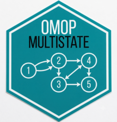
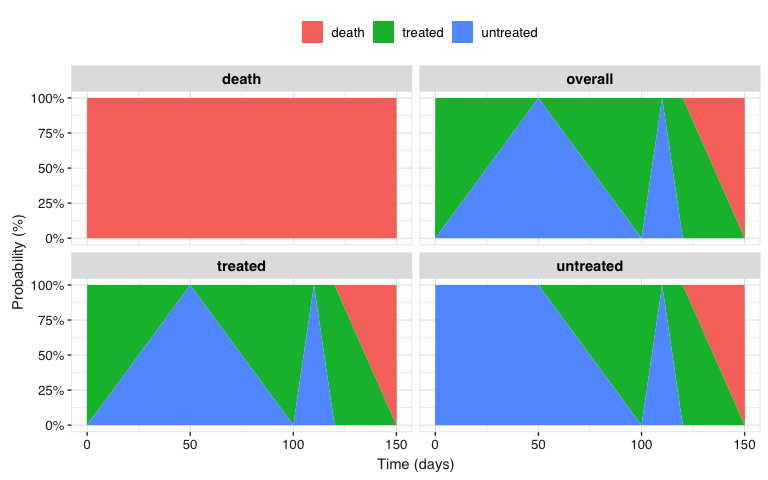

<!-- README.md is generated from README.Rmd. Please edit that file -->

# OmopMultistate 

<!-- badges: start -->

[](https://lifecycle.r-lib.org/articles/stages.html#experimental)
[](https://github.com/oxford-pharmacoepi/OmopMultistate/actions/workflows/R-CMD-check.yaml)
[](https://app.codecov.io/gh/oxford-pharmacoepi/OmopMultistate)
<!-- badges: end -->

**OmopMultistate** estimates how individuals move between clinically
meaningful states over time using cohort records from the OMOP Common
Data Model. Each state is represented by a cohort definition, while a
transition matrix declares which movements between states are possible.

The package provides a workflow to:

- prepare an OMOP `cohort_table` in the long format used by
  [mstate](https://hputter.github.io/mstate/);
- estimate state occupation probabilities overall or for specific
  initial states;
- repeat the analysis across user-defined strata; and
- return results as a standard `summarised_result` object and visualise
  them over time.

## Ecosystem

*OmopMultistate* is part of the ecosystem of packages defined by
[omopgenerics](https://darwin-eu.github.io/omopgenerics/). For more
details on the ecosystem you can read the [Tidy R programming with the
OMOP Common Data
Model](https://ohdsi.github.io/Tidy-R-programming-with-OMOP/) book.

## Tested sources

| Source | Driver | CDM reference | Status |
|----|----|----|----|
| Local R data frame | N/A | `omopgenerics::cdmFromTables()` |  |
| In-memory DuckDB database | duckdb | `CDMConnector::cdmFromCon()` |  |

## Installation

You can install the development version of OmopMultistate from
[GitHub](https://github.com/) with:

``` r
# install.packages("pak")
pak::pak("oxford-pharmacoepi/OmopMultistate")
```

## Example

The following example uses a small mock OMOP CDM containing three
states: `treated`, `untreated`, and the absorbing state `death`.

``` r
library(OmopMultistate)

cdm <- omock::mockCdmFromTables(
  tables = list(
    cohort = dplyr::tibble(
      cohort_definition_id = c(1L, 1L, 1L, 2L, 2L, 3L),
      subject_id = 1L,
      cohort_start_date = as.Date("2020-01-01") +
        c(0L, 100L, 120L, 50L, 110L, 150L),
      cohort_end_date = cohort_start_date
    )
  )
)

cdm$cohort <- CohortConstructor::renameCohort(
  cohort = cdm$cohort,
  newCohortName = c("treated", "untreated", "death")
)
```

Define the allowed transitions. Here, individuals can move between
treatment states or from either treatment state to death; no transitions
out of death are allowed.

``` r
trans <- transMat(
  x = list(c(2, 3), c(1, 3), c()),
  names = c("treated", "untreated", "death")
)

trans
#>            to
#> from        treated untreated death
#>   treated        NA         1     2
#>   untreated       3        NA     4
#>   death          NA        NA    NA
```

Estimate state occupation probabilities over the observed follow-up:

``` r
result <- summariseMultistateProbabilities(
  cohort = cdm$cohort,
  trans = trans
)

result |>
  omopgenerics::tidy() |>
  dplyr::select(
    "initial_state", "variable_name", "variable_level", "probability"
  ) |>
  dplyr::slice_head(n = 10)
#> # A tibble: 10 × 4
#>    initial_state variable_name  variable_level probability
#>    <chr>         <chr>          <chr>                <dbl>
#>  1 overall       prob_death     0                        0
#>  2 overall       prob_treated   0                        1
#>  3 overall       prob_untreated 0                        0
#>  4 overall       prob_death     50                       0
#>  5 overall       prob_treated   50                       0
#>  6 overall       prob_untreated 50                       1
#>  7 overall       prob_death     100                      0
#>  8 overall       prob_treated   100                      1
#>  9 overall       prob_untreated 100                      0
#> 10 overall       prob_death     110                      0
```

The result can be displayed as stacked state occupation probabilities
over time:

``` r
plotMultistateProbabilities(result)
```


