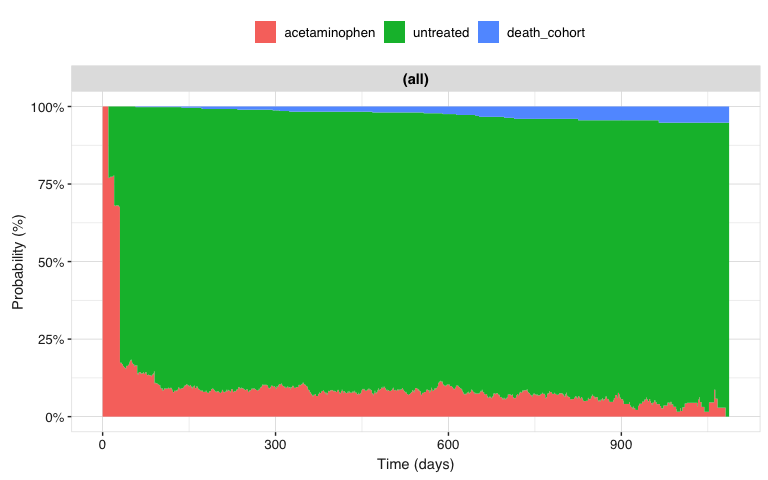

# OmopMultistate

**OmopMultistate** estimates how individuals move between clinically
meaningful states over time using cohort records from the OMOP Common
Data Model. Each state is represented by a cohort definition, while a
transition matrix declares which movements between states are possible.

The package provides a workflow to:

- prepare an OMOP `cohort_table` in the long format used by
  [mstate](https://hputter.github.io/mstate/);
- estimate state occupation probabilities overall or for specific
  initial states;
- repeat the analysis across user-defined strata; and
- return results as a standard `summarised_result` object and visualise
  them over time.

## Ecosystem

*OmopMultistate* is part of the ecosystem of packages defined by
[omopgenerics](https://darwin-eu.github.io/omopgenerics/). For more
details on the ecosystem you can read the [Tidy R programming with the
OMOP Common Data
Model](https://ohdsi.github.io/Tidy-R-programming-with-OMOP/) book.

## Tested sources

| Source | Driver | CDM reference | Status |
|----|----|----|----|
| Local R data frame | N/A | [`omopgenerics::cdmFromTables()`](https://darwin-eu.github.io/omopgenerics/reference/cdmFromTables.html) | [](https://github.com/OHDSI/OmopMultistate/actions/workflows/test-regular.yaml) |
| In-memory DuckDB database | duckdb | [`CDMConnector::cdmFromCon()`](https://darwin-eu.github.io/CDMConnector/reference/cdmFromCon.html) | [](https://github.com/OHDSI/OmopMultistate/actions/workflows/test-regular.yaml) |

## Installation

You can install the development version of OmopMultistate from
[GitHub](https://github.com/) with:

``` r

# install.packages("pak")
pak::pak("OHDSI/OmopMultistate")
```

## Example

The following example uses a small mock OMOP CDM containing three
states: `treated`, `untreated`, and the absorbing state `death`.

``` r

library(OmopMultistate)
library(omock)
library(CohortConstructor)
#> Warning: package 'CohortConstructor' was built under R version 4.4.3
library(CodelistGenerator)
#> Warning: package 'CodelistGenerator' was built under R version 4.4.3
library(dplyr)
#> Warning: package 'dplyr' was built under R version 4.4.3

cdm <- mockCdmFromDataset(datasetName = "synpuf-1k", source = "duckdb")

cdm
```

First we will do the simplest possible case, we analyse discontinuation
of **acetaminophen**. So we will create 3 cohorts: acetaminophen,
discontinuation of acetaminophen (untreated) and death. We will use
[CohortConstructor](https://oxford-pharmacoepi.github.io/OmopMultistate/)
to create the cohorts.

``` r

codes <- getDrugIngredientCodes(cdm = cdm, name = "acetaminophen", nameStyle = "{concept_name}")

# acetaminophen cohort
cdm$acetaminophen <- conceptCohort(cdm = cdm, conceptSet = codes, name = "acetaminophen")
#> ℹ Subsetting table drug_exposure using 6620 concepts with domain: drug.
#> ℹ Combining tables.
#> ℹ Creating cohort attributes.
#> ℹ Applying cohort requirements.
#> ℹ Merging overlapping records.
#> ✔ Cohort acetaminophen created.

# death cohort
cdm$death_cohort <- deathCohort(cdm = cdm, name = "death_cohort")
#> ℹ Applying cohort requirements.
#> ✔ Cohort death_cohort created.

# untreated cohort
cdm$untreated <- cdm$acetaminophen |>
  padCohortEnd(days = 1L, name = "untreated") |>
  padCohortDate(days = 0L, indexDate = "cohort_end_date", cohortDate = "cohort_start_date") |>
  renameCohort("untreated")

# bind them together
cdm <- bind(cdm$acetaminophen, cdm$death_cohort, cdm$untreated, name = "my_study")

# the created cohort
settings(cdm$my_study)
#> # A tibble: 3 × 6
#>   cohort_definition_id cohort_name   cdm_version vocabulary_version
#>                  <int> <chr>         <chr>       <chr>             
#> 1                    1 acetaminophen 5.4         v5.0 29-APR-16    
#> 2                    2 death_cohort  <NA>        <NA>              
#> 3                    3 untreated     5.4         v5.0 29-APR-16    
#> # ℹ 2 more variables: subset_cohort_table <chr>, subset_cohort_id <dbl>
```

Now we will focus on defining the transitions, the individuals can move
from:

- `acetaminophen` to `untreated`
- `acetaminophen` to `death_cohort`
- `untreated` to `acetaminophen`
- `untreated` to `death_cohort`

``` r

trans <- transMat(
  x = list(c(2, 3), c(1, 3), c()),
  names = c("acetaminophen", "untreated", "death_cohort")
)

trans
#>                to
#> from            acetaminophen untreated death_cohort
#>   acetaminophen            NA         1            2
#>   untreated                 3        NA            4
#>   death_cohort             NA        NA           NA
```

Some records can occur on the same date. We resolve these ties in their
logical order, placing death last because it is an absorbing state.

``` r

stateHierarchy <- c("acetaminophen", "untreated", "death_cohort")
```

You can prepare the data in the long format used by
[mstate](https://hputter.github.io/mstate/) and then fit other models:

``` r

msData <- prepareMultistateData(
  cohort = cdm$my_study,
  trans = trans,
  stateHierarchy = stateHierarchy
)

msData |>
  arrange(subject_id, Tstart) |>
  head(10)
#> An object of class 'msdata'
#> 
#> Data:
#>    subject_id from to trans Tstart Tstop status     from_name       to_name
#> 1           1    1  2     1      0    30      1 acetaminophen     untreated
#> 2           1    1  3     2      0    30      0 acetaminophen  death_cohort
#> 3           1    2  1     3     30   373      1     untreated acetaminophen
#> 4           1    2  3     4     30   373      0     untreated  death_cohort
#> 5           1    1  2     1    373   403      1 acetaminophen     untreated
#> 6           1    1  3     2    373   403      0 acetaminophen  death_cohort
#> 7           1    2  1     3    403   532      1     untreated acetaminophen
#> 8           1    2  3     4    403   532      0     untreated  death_cohort
#> 9           1    1  2     1    532   552      1 acetaminophen     untreated
#> 10          1    1  3     2    532   552      0 acetaminophen  death_cohort
```

If we are interested in summarising the probabilities over time we can
use the `summariseMultistateProbabilities` function:

``` r

result <- summariseMultistateProbabilities(
  cohort = cdm$my_study,
  trans = trans,
  stateHierarchy = stateHierarchy
)
```

When run interactively, these functions can print informational (`ℹ`)
messages about records that were excluded. For example, a person who has
a death record but never enters an eligible initial state cannot
contribute to this analysis. These messages describe the input data;
they are not R warnings.

``` r

tidy(result)
#> # A tibble: 9,552 × 9
#>    cdm_name  initial_state variable_name      variable_level probability
#>    <chr>     <chr>         <chr>              <chr>                <dbl>
#>  1 synpuf-1k overall       prob_acetaminophen 0                    1    
#>  2 synpuf-1k overall       prob_untreated     0                    0    
#>  3 synpuf-1k overall       prob_death_cohort  0                    0    
#>  4 synpuf-1k overall       prob_acetaminophen 10                   0.770
#>  5 synpuf-1k overall       prob_untreated     10                   0.230
#>  6 synpuf-1k overall       prob_death_cohort  10                   0    
#>  7 synpuf-1k overall       prob_acetaminophen 12                   0.772
#>  8 synpuf-1k overall       prob_untreated     12                   0.228
#>  9 synpuf-1k overall       prob_death_cohort  12                   0    
#> 10 synpuf-1k overall       prob_acetaminophen 13                   0.774
#> # ℹ 9,542 more rows
#> # ℹ 4 more variables: cohort_table_name <chr>, follow_up_days <chr>,
#> #   state_hierarchy <chr>, state_step <chr>
```

You can visualise now the results. States are displayed in the same
order as they appear in the transition matrix:

``` r

result |>
  filterGroup(initial_state == "acetaminophen") |>
  plotMultistateProbabilities()
```


